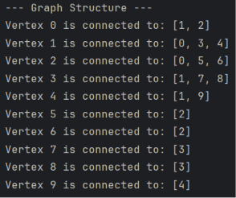
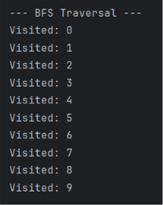
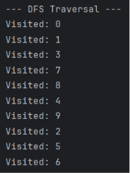
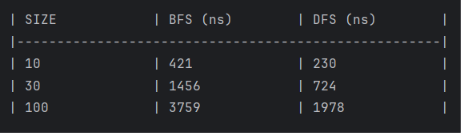
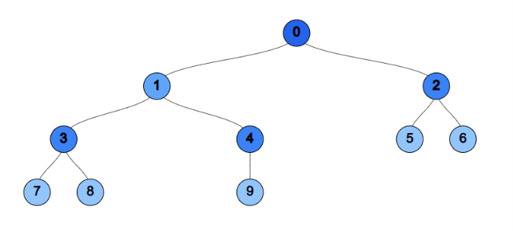

# Assignment 4: Graph Traversal and Representation System

## A. Project Overview
This project implements a Graph data structure from scratch using an Adjacency List. The graph is built using encapsulated `Vertex` and `Edge` objects to represent nodes and their connections.

The system allows for both directed and undirected connections and features two fundamental graph traversal algorithms: **Breadth-First Search (BFS)** and **Depth-First Search (DFS)**. To validate the performance and theoretical time complexity of these algorithms, an automated benchmarking suite (`Experiment.java`) measures execution times across graphs of various sizes (10, 30, and 100 vertices).

## B. Class Descriptions
*   **`Vertex`**: Represents a single node in the graph. It stores a unique integer `id` assigned sequentially by the graph upon insertion.
*   **`Edge`**: Represents a connection between two vertices, holding a reference to the `source` Vertex and the `destination` Vertex.
*   **`Graph`**: The core data structure. It manages vertices in an `ArrayList` and connections via an **Adjacency List** implemented as a `HashMap<Integer, ArrayList<Edge>>`. The Integer key allows for $O(1)$ lookup of a vertex's outgoing edges.
*   **`Experiment`**: A rigorous benchmarking class that utilizes JIT compiler warming and 100,000-iteration averaging to capture highly accurate nanosecond performance metrics for both algorithms.
*   **`Main`**: The driver class that constructs the specific tree-like graph structures, executes the visual traversal demonstration, and triggers the benchmarking suite.

## C. Algorithm Descriptions

### Breadth-First Search (BFS)
**Step-by-step:**
1. Initialize a `Queue` (FIFO) and a `boolean[] visited` array.
2. Mark the starting node as visited and enqueue it.
3. While the queue is not empty, dequeue the current vertex.
4. Retrieve all neighbors of the current vertex.
5. If a neighbor has not been visited, mark it as visited and enqueue it.
6. Repeat until the queue is empty.

*   **Use cases:** Finding the shortest path in an unweighted graph, peer-to-peer networking, GPS navigation, and web crawlers.
*   **Time Complexity:** $O(V + E)$ where $V$ is vertices and $E$ is edges.

### Depth-First Search (DFS)
**Step-by-step:**
1. Implemented via recursion (utilizing the system Call Stack - LIFO).
2. The current node is immediately marked as visited in the `boolean[] visited` array.
3. Retrieve all neighbors of the current vertex.
4. Iterate through the neighbors; if a neighbor is unvisited, recursively call the DFS method on that neighbor.
5. Backtrack automatically when a vertex has no unvisited neighbors.

*   **Use cases:** Maze generation/solving, topological sorting, detecting cycles in a graph, and puzzle solving (e.g., Sudoku).
*   **Time Complexity:** $O(V + E)$

## D. Experimental Results

### Execution Time Comparison
*(Note: Times are averaged over 100,000 iterations after a 15,000-iteration JIT compiler warmup to ensure maximum accuracy).*

| SIZE            | BFS (ns)        | DFS (ns)        |
|-----------------|-----------------|-----------------|
| 10              | 480             | 272             |
| 30              | 1356            | 839             |
| 100             | 3821            | 2191            |

### Observations and Analysis
*   **How does graph size affect performance?** Performance scales linearly. As the graph size roughly triples (10 to 30, and 30 to 100), the execution times for both BFS and DFS also roughly triple.
*   **Which traversal is faster?** In this specific Java environment, **DFS was consistently faster** (by roughly 40-45%).
*   **Do results match expected complexity O(V + E)?** Yes. The linear scaling observed in the data perfectly mirrors the theoretical $O(V + E)$ time complexity. The difference in raw speed between the two algorithms is due to constant factors (overhead), not scaling complexity.
*   **Why is there a speed difference?** DFS utilizes system-level recursion (the Call Stack), which is highly optimized. BFS requires the constant instantiation and manipulation of a `Queue` object, adding overhead. Furthermore, DFS's "deep" traversal pattern benefits from CPU cache locality, whereas BFS's wide traversal causes more frequent cache misses.
*   **When is BFS preferred?** When finding the shortest path between two nodes. DFS limitations include not finding the optimal path and the potential for a `StackOverflowError` if the graph is exceptionally deep.

## E. Screenshots

*   
*   
*   
*   
*   

## F. Reflection Section

Throughout this assignment, I gained a deep understanding of how to translate theoretical graph concepts into a working, object-oriented system. Building the Adjacency List using a `HashMap` mapping Integer IDs to a List of `Edge` objects helped me visualize exactly how memory is managed in network structures. The most fascinating takeaway was seeing the difference between theoretical Big-O complexity and actual machine-level performance; while both BFS and DFS scale identically ($O(V+E)$), the object overhead of a Queue makes BFS demonstrably slower than recursive DFS in execution.

The biggest challenge I faced was managing the internal state of the vertices and ensuring the JIT compiler didn't skew the benchmarking results. Initially, using a static ID generator caused crashes when generating multiple graphs, which I resolved by shifting ID management to the `Graph` class itself. Additionally, I learned that printing to the console drastically reduces performance, leading me to implement a `silent` toggle to isolate algorithm speed from I/O rendering times.